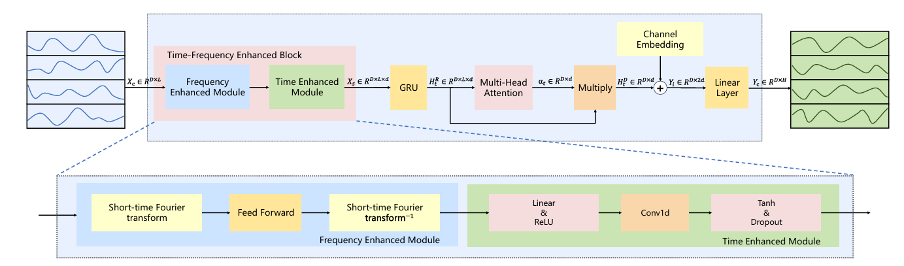
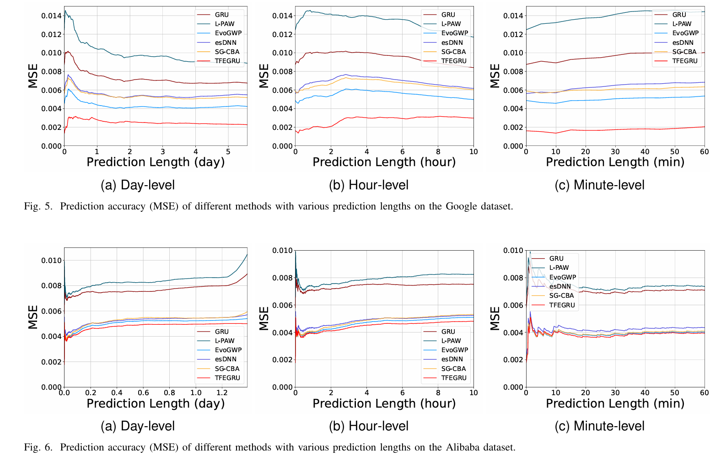
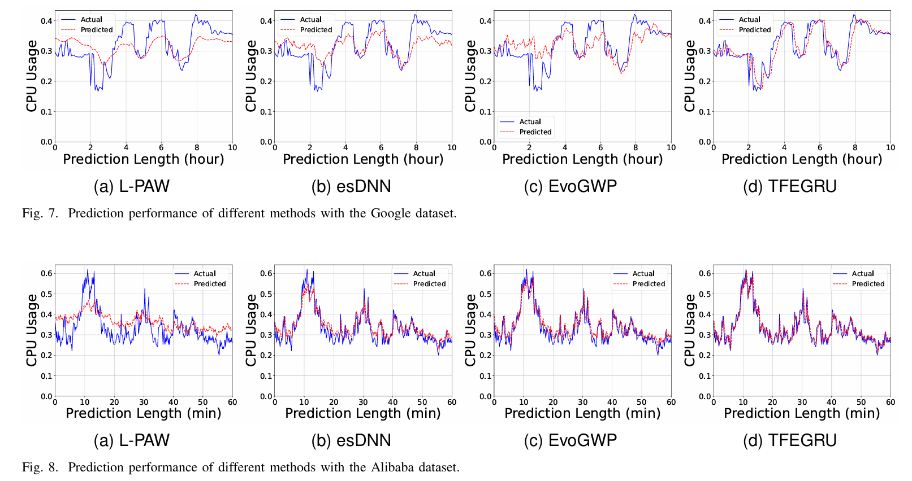
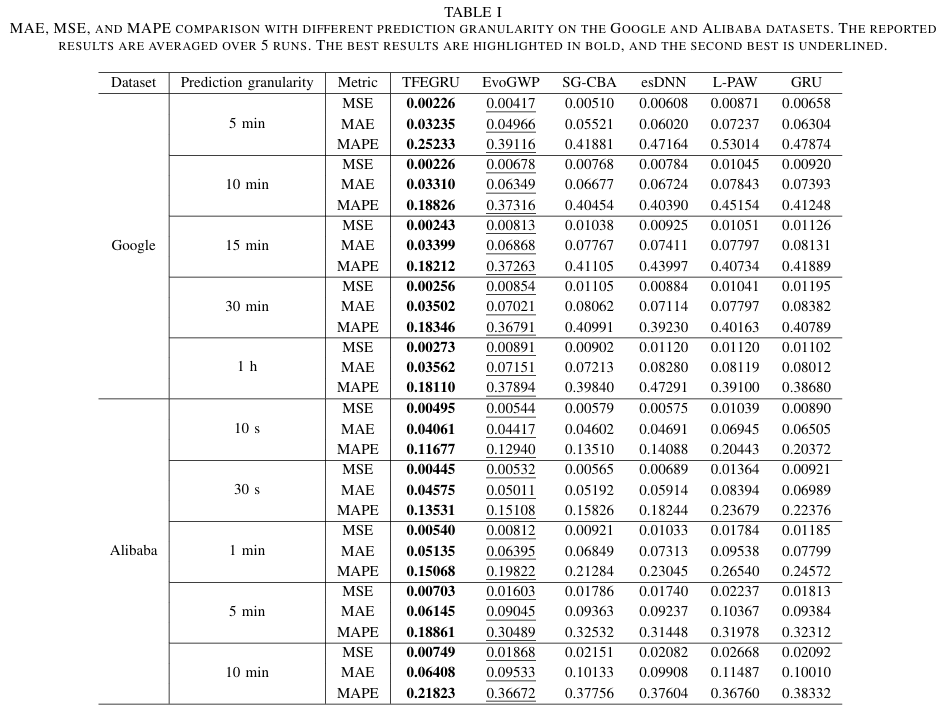
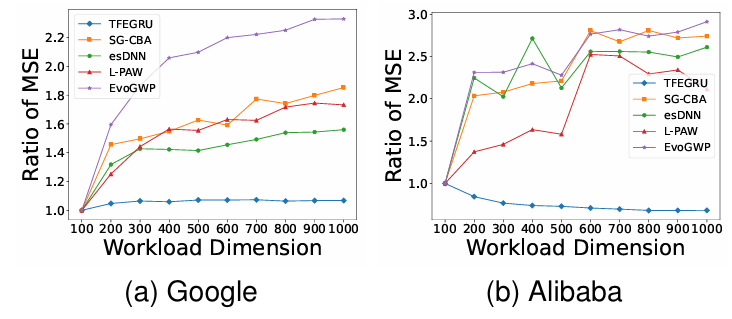

# TFEGRU

---

Welcome to the official repository of the TFEGRU paper: "[TFEGRU: Time-Frequency Enhanced Gated  Recurrent Unit with Attention for Cloud Workload  Prediction](https://ieeexplore.ieee.org/abstract/document/10797693)"

## Introduction

---

TFEGRU is an accurate and adaptive cloud workload prediction approach. It utilizes the TimeFrequency Enhanced Block to combine both frequency and time-domain information, effectively identifying and extracting complex cloud workload patterns. And TFEGRU introduces a channel independent strategy and channel embedding to eliminate noise interference from high-dimensional data and enhance predictive performance. Employing GRU in conjunction with a multi-head self-atention mechanism helps TFEGRU achieve adaptive and accurate prediction of highly complex workloads.  



TFEGRU outperforms other methods consistently across different prediction lengths. Notably, on the Alibaba dataset, TFEGRU performs significantly better at longer prediction lengths, highlighting its ability to capture long-term dependencies.



TFEGRU exhibits superior predictive accuracy on highly random workloads from Google and Alibaba cloud data centers. The prediction curve provides a better fit to the actual values.



Meanwhile, TFEGRU outperforms other methods across all prediction granularities on both datasets, showing significant improvements. 



By individually processing each channel of workload and employing a unified model for learning, TFEGRU demonstrates enhanced robustness and capacity to extract information from high-dimensional workloads.



## Getting Start

---

### Environment Requirements

To get started, ensure you have Conda installed on your system and follow these steps to set up the environment:

```cmd
conda create -n TFEGRU python=3.8
conda activate TFEGRU
pip install -r requirements.txt
```

### Data preparation

The Google datasets for TFEGRU can be obtained from [Google-cluster-data](https://github.com/google/cluster-data) provided by Google. The Alibaba datasets for TFEGRU can be obtained from [Alibaba-cluster-data](https://github.com/alibaba/clusterdata) provided by Alibaba Group. Create a separate folder named `./dataset` and place all the CSV files in this directory. **Note**: Place the CSV files directly into this directory, such as "./dataset/alibaba_100.csv"

### Training Example

You can easily reproduce the results from the paper by running the provided script command. For instance, to reproduce the main results, execute the following command:

```cmd
sh run.sh
```

Similarly, you can specify separate scripts to run independent tasks, such as obtaining results on alibaba:

```cmd
sh scripts/alibaba.sh
```

